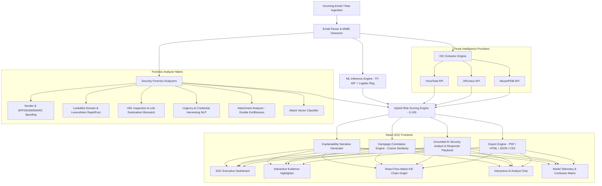

# PS-02: Phishing Attack Investigation & Correlation Platform

[](https://www.python.org/)
[](https://fastapi.tiangolo.com/)
[](https://react.dev/)
[](https://tailwindcss.com/)
[](https://scikit-learn.org/)
[]()

A comprehensive, production-grade **AI-Assisted Phishing Attack Investigation & Campaign Correlation Platform** built for SOC (Security Operations Center) analysts and incident response teams.

---

## 🎯 Master Demo Scenario

When an employee receives a deceptive email:

* **From**: `security@paypa1-login.com`
* **Subject**: `Your account will be suspended!`
* **URL**: `http://paypa1-login.com/verify`

Instead of returning an opaque "AI verdict", PS-02 performs multi-layer forensic dissection, extracting evidence across 6 distinct security domains, generating an explainable **92/100 Risk Score**, classifying the attack as **Credential Harvesting**, extracting all IOCs, mapping the **React Flow Kill-Chain**, and recommending automated SOC containment playbooks.

---

## 🏛️ System Architecture



---

## 🛡️ Key Platform Capabilities

### 1. Multi-Dimensional Forensic Analyzers
* **Sender Identity**: Detects display name mismatch (`"PayPal Support" <attacker@domain.com>`), free mail provider spoofing (`@gmail.com`), and reply-to deviations.
* **Lookalike & Typosquatting Engine**: Uses RapidFuzz Levenshtein similarity, character substitution maps (`1 -> l`, `0 -> o`, `vv -> w`), combosquatting detection, Punycode/IDN homographs, and high-risk TLD analysis.
* **URL & Link Mismatch**: Static URL inspector detecting raw IP hosts, unencrypted HTTP login forms, hex obfuscation, and **Link Destination Mismatch** (`<a>` text shows `paypal.com` but `href` points to `evil-phish.com`).
* **Attachment Armor**: Identifies deceptive double extensions (`.pdf.exe`), raw executable binaries, malicious scripts (`.vbs`, `.ps1`), macro Office docs (`.docm`), and disc image containers (`.iso`).
* **Attack Vector Classifier**: Categorizes attacks into: `credential_harvesting`, `account_takeover`, `financial_fraud`, `malware_delivery`, `business_email_compromise`, or `data_theft`.

### 2. Explainable Hybrid Risk Scoring (0–100)
Combines ML statistical inference with deterministic forensic rules:
$$\text{Score} = \text{ML (30\%)} + \text{Domain/Brand (25\%)} + \text{URL (20\%)} + \text{Sender (10\%)} + \text{Content (10\%)} + \text{Threat Intel (5\%)}$$

* **0–25**: `legitimate` (Clean scan, benign corporate communications)
* **26–55**: `suspicious` (Minor anomalies, heightened monitoring)
* **56–85**: `phishing` (High risk, confirmed phishing indicators)
* **86–100**: `critical_phishing` (Urgent credential harvesting or weaponized payload)

### 3. Machine Learning Pipeline & Hugging Face Primary Training
* **Dataset**: Primary dataset is Hugging Face [`mamtakumar/seven-phishing-email-datasets`](https://huggingface.co/datasets/mamtakumar/seven-phishing-email-datasets) loaded via `load_dataset("mamtakumar/seven-phishing-email-datasets")`.
  - **Raw Ingested Records**: 203,017 raw emails (`train`: 162,413, `eval`: 20,300, `test`: 20,304).
  - **Clean & Deduplicated Records**: 202,407 clean emails (94,186 Phishing, 108,221 Benign).
  - **Cross-Split Leak Prevention**: Train-validation and train-test duplicate overlaps automatically stripped.
  - **Holdout Test Set (20,198 samples)**: **98.42% Accuracy**, **98.22% Precision**, **98.38% Recall**, **98.30% F1-Score**, **0.9988 ROC-AUC**.
* **Training Command**:
  ```bash
  python -m backend.ml.train --hf
  ```
  *(Or with optional sampling: `python -m backend.ml.train --max-samples 50000`)*
* **Model Telemetry API** (`GET /api/model/metrics`): Returns live Accuracy, Precision, Recall, F1-Score, ROC-AUC, 4-cell Confusion Matrix, and top feature weights.

### 4. Pluggable Threat Intelligence
* Pluggable async clients for **VirusTotal**, **URLhaus**, and **AbuseIPDB**.
* **Safety Rule**: If an API key is unconfigured or a service is down, the status is marked `"Unknown / Not checked"` (never falsely assumed safe).

### 5. Multi-Incident Campaign Correlation
* Multi-dimensional similarity scoring combining TF-IDF cosine similarity, target brand matching, and shared infrastructure overlap.
* Clusters related attacks into campaigns (e.g. `CAMP-2026-001: Global PayPal Harvesting Campaign` targeting 27 emails across 19 recipients).
* Visualized via interactive **React Flow DAG graph topologies**.

### 6. Grounded AI Security Analyst & Action Playbook
* SOC analysts can interactively query the AI Analyst for natural language explanations, brand risk, and containment steps.
* **Strict Grounding**: The AI answers strictly using structured JSON evidence, preventing hallucinations.
* Prioritized SOC remediation playbook with interactive execution checkboxes.

### 7. Multi-Format Incident Dossiers
* **ReportLab PDF**: Multi-page styled executive report with risk meters and indicator tables.
* **Interactive HTML**: Standalone viewable HTML dossier.
* **JSON**: Machine-readable schema for SIEM/SOAR ingestion.
* **CSV**: 1-click IOC export for firewall/EDR blacklisting.

---

## 🚀 Quickstart Guide

### Prerequisites
* Python 3.12+
* Node.js 20+ & npm

### Method 1: Local Development (Fastest)

#### 1. Start Backend
```bash
# In project root
python -m pip install -r requirements.txt

# Train production ML model on Hugging Face dataset (mamtakumar/seven-phishing-email-datasets)
python -m backend.ml.train --hf

# Start FastAPI server on http://localhost:8000
python -m uvicorn backend.main:app --host 0.0.0.0 --port 8000 --reload
```

#### 2. Start Frontend
```bash
# In project root (new terminal)
npm install
npm run dev
# Frontend available at http://localhost:5173
```

---

### Method 2: Docker Compose (Production Stack)

```bash
docker-compose up --build
```
* **Frontend**: `http://localhost:5173`
* **FastAPI Backend**: `http://localhost:8000`
* **Interactive OpenAPI Docs**: `http://localhost:8000/docs`
* **PostgreSQL**: `localhost:5432`

---

## 🧪 Verification & Test Suite

Run the full automated backend test suite (30 unit & integration tests):

```bash
python -m pytest tests/ -v
```

### Test Coverage Highlights:
1. `tests/test_parser.py`: RFC 822 parsing, HTML link extraction, attachment metadata.
2. `tests/test_analyzers.py`: Sender spoofing, brand lookalike typosquatting, legitimate brand handling, link destination mismatch, urgency detection, double extension payload detection.
3. `tests/test_ml.py`: Text preprocessing, feature combination, ML probability predictions.
4. `tests/test_risk.py`: Hybrid risk calculation, verdict threshold calibration, explainability narrative consistency.
5. `tests/test_campaigns.py`: Similarity scoring and campaign clustering.
6. `tests/test_api.py`: FastAPI endpoints, master demo scenario verification, report generation, AI explain endpoint.

---

## 📚 REST API Reference

| Method | Endpoint | Description |
| :--- | :--- | :--- |
| `POST` | `/api/analyze` | Ingest raw email text / JSON headers for full investigation |
| `POST` | `/api/analyze/upload` | Ingest `.eml` or `.msg` file for analysis |
| `GET` | `/api/incidents` | Query searchable incident queue with verdict filters |
| `GET` | `/api/incidents/{id}` | Retrieve complete investigation dossier for an incident |
| `GET` | `/api/incidents/{id}/iocs` | Export IOCs in JSON or CSV format (`?format=csv`) |
| `GET` | `/api/incidents/{id}/report` | Download Incident Report in PDF, HTML, or JSON (`?format=pdf`) |
| `POST` | `/api/incidents/{id}/feedback`| Record human analyst feedback (`confirmed_phishing`, `false_positive`) |
| `GET` | `/api/campaigns` | List all correlated phishing campaigns |
| `GET` | `/api/campaigns/{id}` | Get campaign details and React Flow cluster graph |
| `GET` | `/api/model/metrics` | Retrieve live scikit-learn evaluation benchmarks and confusion matrix |
| `POST` | `/api/ai/explain` | Grounded AI Security Analyst conversational endpoint |
| `GET` | `/api/dashboard/stats` | Retrieve aggregated SOC defense telemetry for dashboard cards |
| `GET` | `/api/demo/samples` | List 10+ pre-built demo attack scenarios |
| `GET` | `/api/health` | System health check and analyzer status |

---

## 🌐 LAN / Hackathon Demo Setup

To demonstrate the platform live from a second laptop, tablet, or phone connected to the same Wi-Fi / local network:

### 1. Step-by-Step Instructions

#### Step 1: Find your Host Laptop's Local IPv4 Address
Open PowerShell or Command Prompt on the main laptop running the servers:
```powershell
ipconfig
```
Look for your active network adapter (e.g. `Wireless LAN adapter Wi-Fi` or `Ethernet adapter`) and locate the **IPv4 Address** (e.g., `192.168.1.50` or `172.120.9.24`).

#### Step 2: Start the FastAPI Backend on `0.0.0.0`
In project root:
```bash
python -m uvicorn backend.main:app --host 0.0.0.0 --port 8000
```
*(The backend binds to all interfaces, enabling incoming requests from localhost and other LAN devices).*

#### Step 3: Start the Vite React Frontend on `0.0.0.0`
In a second terminal window:
```bash
npm run dev -- --host 0.0.0.0
```
*(Vite binds to port `5173` on `0.0.0.0` and prints your network URLs).*

#### Step 4: Open the Application from the Second Laptop
Connect the second laptop/device to the **same Wi-Fi/network** and open its web browser:

* **SOC Analyst Dashboard (Frontend)**:
  ```
  http://<MAIN_LAPTOP_IP>:5173
  ```
  *(e.g., `http://192.168.1.50:5173` or `http://172.120.9.24:5173`)*

* **Interactive OpenAPI Swagger Docs (Backend)**:
  ```
  http://<MAIN_LAPTOP_IP>:8000/docs
  ```

* **Backend Health Check**:
  ```
  http://<MAIN_LAPTOP_IP>:8000/api/health
  ```

---

### 2. Architecture & Data Flow Across LAN

```
Second Laptop Browser (Any OS / Mobile)
        │  (HTTP GET http://<MAIN_LAPTOP_IP>:5173)
        ▼
Main Laptop Vite React Web Server (Port 5173)
        │  (Client-side REST API calls to http://<MAIN_LAPTOP_IP>:8000/api)
        ▼
Main Laptop FastAPI Server (Port 8000)
        │
   ┌────┴───────────────────────────┐
   ▼                                ▼
SQLite / PostgreSQL DB     ML Phishing Inference (scikit-learn)
```

---

### 3. LAN Troubleshooting & Common Pitfalls

| Issue | Root Cause | Solution |
| :--- | :--- | :--- |
| **`ERR_CONNECTION_REFUSED`** | Backend or frontend is bound to `127.0.0.1` instead of `0.0.0.0`. | Ensure you run Uvicorn with `--host 0.0.0.0` and Vite with `--host 0.0.0.0`. |
| **Windows Firewall Blocks Incoming Traffic** | Windows Defender Firewall blocks incoming TCP on Python/Node. | Open Windows Defender Firewall $\rightarrow$ *Allow an app through firewall* $\rightarrow$ check **Python** and **Node.js** for **Private** networks. Alternatively, add inbound rules for TCP ports `5173` and `8000`. |
| **CORS Errors in Browser Console** | Backend does not recognize the origin of the second device. | The backend automatically matches private LAN subnets via `CORS_ORIGIN_REGEX`. If using a custom domain or subnet, set `CORS_ORIGINS=http://<SECOND_IP>:5173` in `.env`. |
| **API Still Pointing to Localhost** | Hardcoded `localhost` in client code. | The frontend API service (`src/services/api.ts`) automatically uses `window.location.hostname` so requests match the host in the address bar. To manually override, create `.env.local` with `VITE_API_URL=http://<MAIN_LAPTOP_IP>:8000/api`. |
| **Cannot Connect from Second Laptop** | Devices are on different Wi-Fi networks (e.g. Guest Wi-Fi with AP Isolation). | Ensure both laptops are connected to the same standard Wi-Fi network and AP Client Isolation is disabled on the router. |

---

## 👥 Hackathon Team & PS-02 Solution

* **Project**: PS-02 — Phishing Attack Investigation Platform
* **Architecture**: Modular Python FastAPI Backend + React 19 SOC Frontend + scikit-learn ML Pipeline + ReportLab PDF Engine + SQLite/PostgreSQL Database
* **Status**: Complete Production-Ready Prototype & Verified Test Suite

